# Installing Motherboards and Connectors

## LESSON INTRODUCTION

One of the main roles for a CompTIA A+ technician is to install and configure personal computer (PC) hardware. This hands-on part of the job is what draws many people to a career in information technology (IT) support. As an IT professional, you will set up desktop computers and help end users to select a system configuration and peripheral devices that are appropriate to their work. You will often have to connect peripheral devices using the correct cables and connectors and install plug-in adapter cards.

To complete these tasks, you must understand how the peripheral devices and internal PC components are connected via the motherboard. As you may encounter many different environments in your work, you must also be able to distinguish and support both modern and legacy connection interfaces.

## Lesson Objectives

In this lesson, you will:

-   Explain cable types and connectors.
-   Install and configure motherboards.
-   Explain legacy cable types.

Topic 1A

Explain Cable Types and Connectors

<figure>

3.1 Explain basic cable types and their connectors, features, and purposes.

</figure>

A PC is made up of many different components. All these components need to be able to communicate with each other so that the computer can function properly. If you can distinguish connection interfaces and connectors quickly, you will be able to support users by installing, upgrading, and replacing PC peripherals efficiently.

# Personal Computers

The components of a [personal computer (PC)] are divided between those that are designed to be handled by the user---peripheral devices---and those that would be damaged or dangerous if exposed. Peripheral devices typically perform the function of input (keyboard, mouse, microphone, and camera), output (monitor and speakers), or external storage.

The system case/chassis houses the internal components. These include the motherboard, central processing unit (CPU), system memory modules, adapter cards, fixed disks, and power supply unit. Most cases use a tower form factor that is designed to be oriented vertically and can be placed on a desk or on the floor.

PCs can also be purchased as all-in-one
units All-in-one means that the internal components are contained within a case that is also a monitor

To perform PC maintenance, you must understand how to open a desktop computer\'s case.

-   A tower case has a side cover that can be removed by sliding the panel from its housing. Cases might be secured by screws or retaining clips and might have anti-tamper security mechanisms. Always refer to the system documentation, and follow the recommended steps.
-   The front panel provides access to the removable media drives, a power on/off switch, and light- emitting diodes (LEDs) to indicate drive operation. The front cover can be removed but may require the side panel to be removed first to access the screws or clips that secure it. 

___

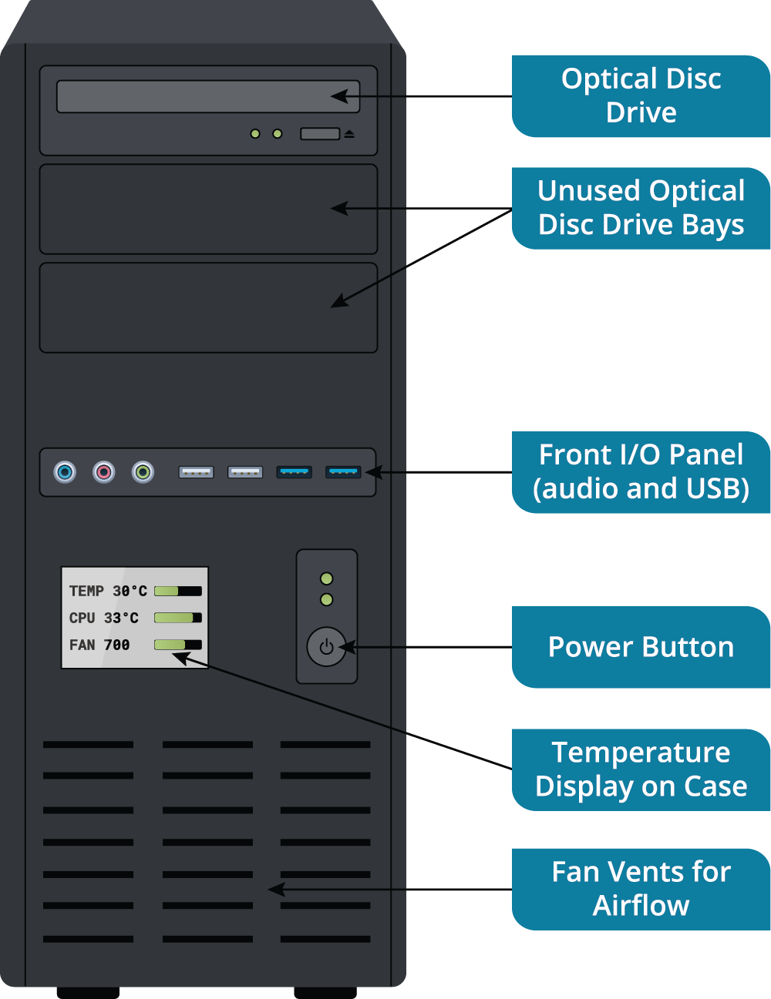

Features on the front of a typical PC case. (Image © 123RF.com)

The rear panel provides access to the power supply unit (PSU) sockets. The PSU has an integral fan exhaust. Care should be taken that it is not obstructed, as this will adversely affect cooling. There may be an additional case fan.

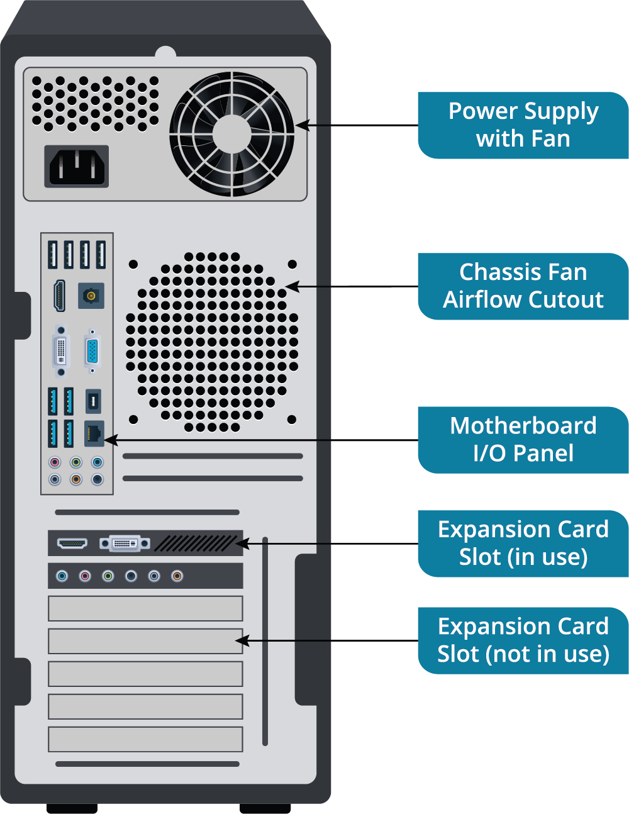 

Features on the rear panel of a typical PC case. (Image ©
123RF.com)

Below the PSU, there is a cutout aligned with the motherboard's (I/O) ports. These allow for the connection of peripheral devices.

At the bottom of the rear panel there are cutout slots aligned with the position of adapter card slots to allow cables to be connected to any I/O ports on the cards. These slots should either be covered by an adapter card or a metal strip known as a blanking plate. Uncovered slots can disrupt the proper flow of air around components in the PC and cause overheating and increase the amount of dust in the system.

# Peripheral Devices

An input/output (I/O) port allows a device to be connected to the PC via a **peripheral cable**. Some ports are designed for a particular type of device, such as a graphics port to connect a monitor. Other ports support a variety of device types. External ports are positioned at the rear or front of the PC through cutouts in the case. They can be provided on the motherboard or as an expansion card.

<figure>
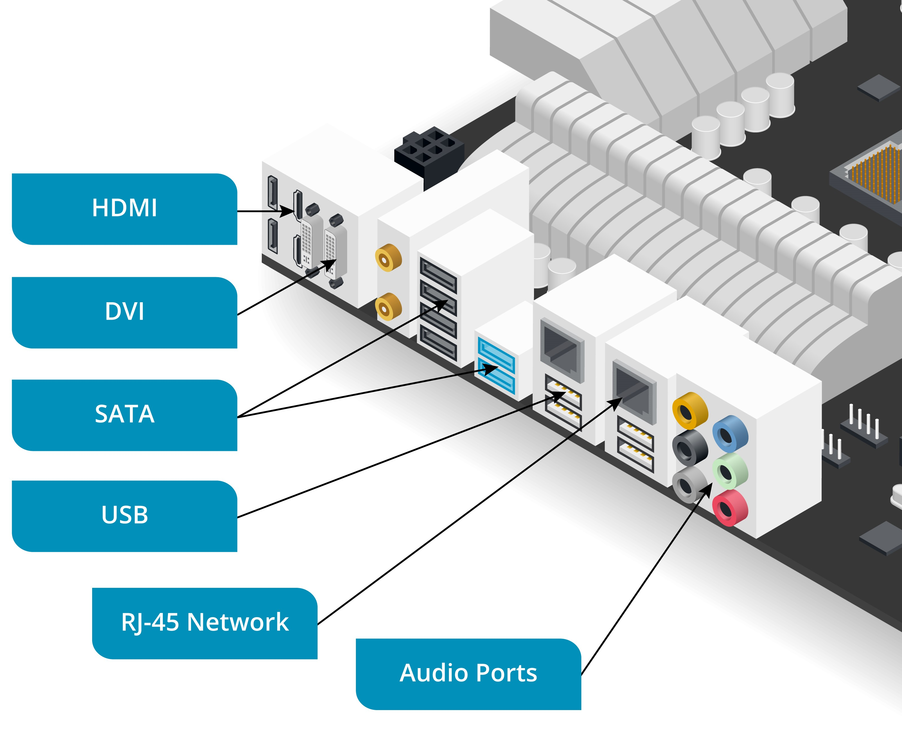

I/O ports on a motherboard. (Image © 123RF.com)

</figure>

## Interfaces, Ports, and Connectors

A hardware port is the external connection point for a particular type of bus interface. A bus allows the transfer of data to and from devices. The connector is the part of a peripheral cable that can be inserted into a port with the same shape or form factor. Each bus interface type might use multiple connector form factors. Most connectors and ports now use edge contacts and either have an asymmetric design called *keying* to prevent them from being inserted the wrong way around or are reversible.

<figure>
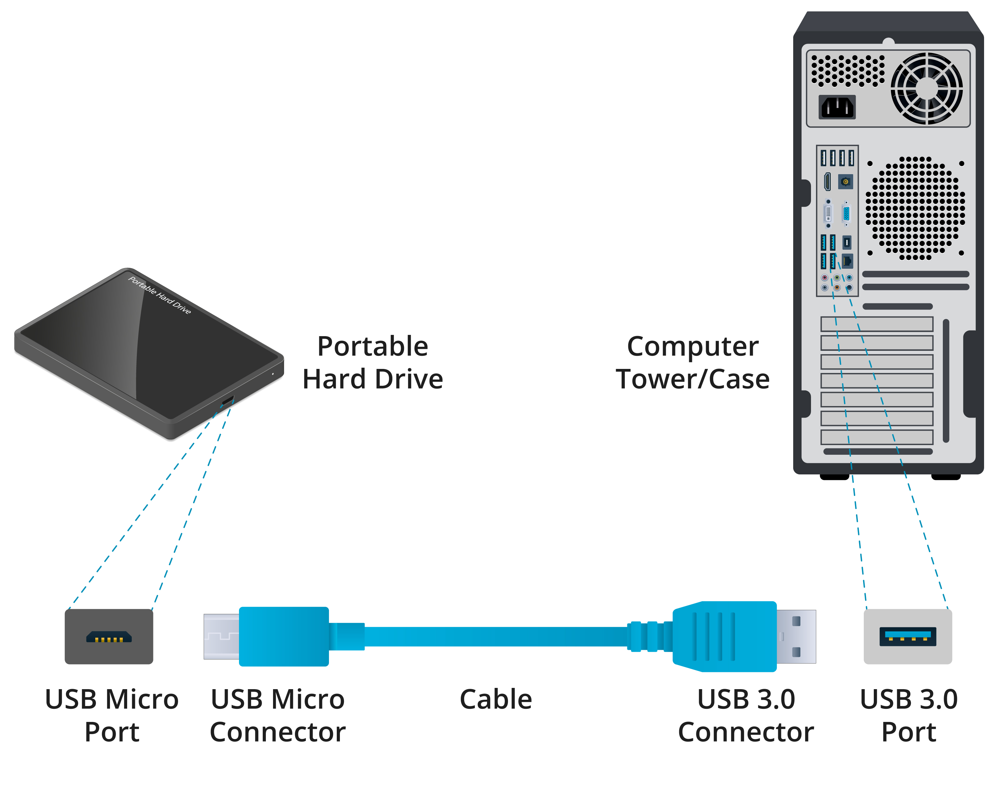

A peripheral cable for the Universal Serial Bus (USB) interface with
different connector types being used to connect a portable hard drive
and a desktop computer. (Image © 123RF.com)

</figure>

## Binary Data Storage and Transfer Units

When comparing bus interfaces, it is important to use appropriate units. Computers process binary data. Each binary digit or bit (b) can have the value one or zero. Storage is often measured in multiples of eight bits, referred to as a byte (B). A lowercase "b" unit refers to a bit, while uppercase means a byte.

Transfer rates are expressed in units per second of the followingmultiples of bits and bytes:

-   1000---Kilobits (Kb/s or Kbps) and kilobytes (KB/s and KBps).
-   1000x1000---Megabits (Mb/s) or megabytes (MB/s).
-   1000x1000x1000---Gigabits (Gb/s) and gigabytes (GB/s).

# Peripheral Devices

An input/output (I/O) port allows a device to be connected to the PC via a **peripheral cable**. Some ports are designed for a particular type of device, such as a graphics port to connect a monitor. Other ports support a variety of device types. External ports are positioned at the rear or front of the PC through cutouts in the case. They can be provided on the motherboard or as an expansion card.

<figure>

I/O ports on a motherboard. (Image © 123RF.com)

</figure>

## Interfaces, Ports, and Connectors

A hardware port is the external connection point for a particular type
of bus interface. A bus allows the transfer of data to and from devices.
The connector is the part of a peripheral cable that can be inserted
into a port with the same shape or form factor. Each bus interface type
might use multiple connector form factors. Most connectors and ports now
use edge contacts and either have an asymmetric design called
*[keying]{#hash8239fb74-823b-4ac0-a929-2f1472806788 .gt-highlight
gt-highlight="{\"characterRange\":{\"start\":920,\"end\":926},\"backward\":false,\"id\":\"hash8239fb74-823b-4ac0-a929-2f1472806788\",\"text\":\"keying\",\"isNote\":false,\"location\":\"bc78d9ee-c3b4-432a-9104-29a9c9e6718b.html\",\"color\":\"#FFEB6B\",\"style\":\"width:690.9090576171875px; height:500.3692932128906px;\"}"
tabindex="0" role="button"
gt-highlight-id="hash8239fb74-823b-4ac0-a929-2f1472806788"
style="background-color: rgb(255, 235, 107); margin: 0px; padding: 0px;"
aria-label="Yellow Highlight started. keying, Highlight ended."}* to
prevent them from being inserted the wrong way around or are reversible.

<figure>

A peripheral cable for the Universal Serial Bus (USB) interface with
different connector types being used to connect a portable hard drive
and a desktop computer. (Image © 123RF.com)

</figure>

Binary Data Storage and Transfer Units

When comparing bus interfaces, it is important to use appropriate units.
Computers process binary data. Each binary digit or bit (b) can have the
value one or zero. Storage is often measured in multiples of eight bits,
referred to as a byte (B). A lowercase "b" unit refers to a bit, while
uppercase means a byte.

Transfer rates are expressed in units per second of the following
multiples of bits and bytes:

-   1000---Kilobits (Kb/s or Kbps) and kilobytes (KB/s and KBps).
-   1000x1000---Megabits (Mb/s) or megabytes (MB/s).
-   1000x1000x1000---Gigabits (Gb/s) and gigabytes (GB/s).

HDMI and DisplayPort Video Cables

The USB interface supports many types of devices, but it has not
traditionally been used for video. As video has high bandwidth demands,
it is typically provisioned over a dedicated interface.

**Video cable** bandwidth is determined by two main factors:

-   The resolution of the image, measured in horizontal pixels by
    vertical pixels. For example, 1920x1200 is the typical format of
    high-definition (HD) video and 3840x2160 is typical of 4K video.
-   The speed at which the image is redrawn, measured in hertz (Hz) or
    frames per second (fps).

As examples, uncompressed HD video at 60 fps requires 4.5 Gbps, while 4K
at 60 fps requires 8.91 Gbps.

<figure>

The
frame rate in fps is used to describe the video source, while hertz is
the refresh rate of the display device and video interface. To avoid
display artefacts such as ghosting and tearing, the refresh rate should
match the frame rate or be evenly divisible by it. For example, if the
frame rate is 60 fps and the refresh rate is 120 Hz, the video should
play smoothly.

</figure>

Computer displays are typically of the [liquid crystal display
(LCD)]{#hash28d71dd8-e5a2-45ab-bffa-7d42157f5e61 .gt-highlight
gt-highlight="{\"characterRange\":{\"start\":1082,\"end\":1110},\"backward\":false,\"id\":\"hash28d71dd8-e5a2-45ab-bffa-7d42157f5e61\",\"text\":\"liquid%20crystal%20display%20(LCD)\",\"isNote\":false,\"location\":\"9c08b5e6-cff6-45bb-bf19-2a681c5dce04.html\",\"color\":\"#FFEB6B\",\"style\":\"width:690.9090576171875px; height:500.3692932128906px;\"}"
tabindex="0" role="button"
gt-highlight-id="hash28d71dd8-e5a2-45ab-bffa-7d42157f5e61"
style="background-color: rgb(255, 235, 107); margin: 0px; padding: 0px;"
aria-label="Yellow Highlight started. liquid crystal display (LCD), Highlight ended."}
t[hin film transistor (TFT) type. ]{data-type=""}Each pixel in a color
LCD comprises cells with filters to generate the three additive primary
colors red, green, and blue (RGB). Each pixel is addressed by a
transistor to vary the intensity of each cell, therefore creating the
gamut (range of colors) that the display can generate. The panel is
illuminated by a light-emitting diode (LED) array or backlight.

<figure>

An LCD/TFT is often just referred to as a
flat-panel display. They are also called LED
displays after the backlight technology (older flat panels use
fluorescent tube backlights). Premium flat-panel monitors
are of the organic LED (OLED) type. This means that each pixel is its
own light source. This allows for much better contrast and color
fidelity.

</figure>

High-Definition Multimedia Interface

The [[**High-Definition Multimedia Interface (HDMI)**]{.glossary-term
data-type=""}]{#a5c33c44-d295-4f78-9dc8-82765ea91691 .gt-note
.definition
note="
 Digital audio/video interface developed for use on both consumer electronics and computer equipment.
"
ref-id="41949243-1da2-41f1-88ca-70a480ee16e3"
external-id="2df2f3ca-3dff-48a6-aaaa-24a137d4e981"
gtnote="1696350144482--0.3900065876271761"} is the most widely used
video interface. It is ubiquitous on consumer electronics, such as
televisions, games consoles, and Blu-ray players as well as on monitors
designed for use with PCs. HDMI supports both video and audio, plus
remote control and digital content protection (HDCP). Updates to the
original HDMI specification have introduced support for high
resolutions, such as 4K and 8K, and gaming features, such as the ability
to vary the monitor refresh rate to match the frame rate of the video
source.

<figure>

Support for audio is useful because most TVs and monitors have
built-in speakers. The video card must have an audio chipset for this to
work, however.

</figure>

There are full-size (Type A), mini (Type C), and micro (Type D)
connectors, all of which are beveled to ensure correct orientation.

<figure>

HDMI connector and port on the left and mini-HDMI connector and port
on the right. (Image ©123RF.com)

</figure>

HDMI cable is rated as either Standard (Category 1) or High Speed
(Category 2). High Speed cable supports greater lengths and is required
for v1.4 features, such as 4K and refresh rates over 60 Hz. HDMI
versions 2.0 and 2.1 specify Premium High Speed (up to 18 Gbps) and
Ultra High Speed (up to 48 Gbps) cable ratings.

DisplayPort Interface

HDMI was developed by consumer electronics companies and requires a
royalty to use. [[**DisplayPort**]{.glossary-term
data-type=""}]{#1fe57f41-b7ff-490c-8d70-0388fbfc6266 .gt-note
.definition
note="
 Digital audio/video interface developed by VESA. DisplayPort supports some cross-compatibility with DVI and HDMI devices.
"
ref-id="c811fa41-f62f-4b87-801c-f2bf4fb212f4"
external-id="77aa16c9-8d08-4c3e-87b6-1ea8abd48b60"
gtnote="1696350144482--0.10773415724101976"} was developed as a
royalty-free standard by the Video Electronics Standards Association
(VESA), which is an organization that represents PC graphics adapter and
display technology companies. DisplayPort supports similar features to
HDMI, such as 4K, audio, and content protection. There are full-size
DP++ and MiniDP/mDP port and connector types, which are keyed against
incorrect orientation.

<figure>
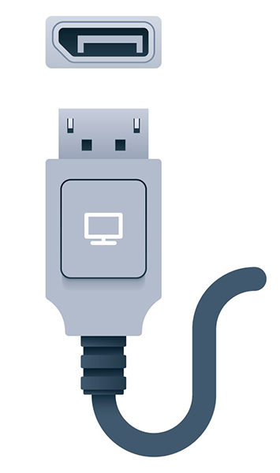

A DP++ DisplayPort port and connector. (Image ©123RF.com)

</figure>

Bandwidth can be allocated in bonded lanes (up to four). The bitrate of
each lane was originally 2.7 Gbps but is now (with version 2.0) up to 20
Gbps.

One of the main advantages of DisplayPort over HDMI is support for
daisy-chaining multiple monitors to the same video source. Using
multiple monitors with HDMI requires one video card port for each
monitor.

Thunderbolt and Lightning Cables

Although the Thunderbolt and Lightning interfaces are most closely
associated with Apple computers and mobile devices, Thunderbolt is
increasingly implemented on Windows and Linux PCs too.

Thunderbolt Interface

[[**Thunderbolt**]{.glossary-term
data-type=""}]{#bb1b769c-e7af-4f2b-8954-7c0dda7e8567 .gt-note
.definition
note="
 Thunderbolt can be used as a display interface (like DisplayPort) and as a general peripheral interface (like USB 3). The latest version uses USB-C connectors.
"
ref-id="6ca3b2a0-6132-45c2-b467-86296ace9765"
external-id="74d9937e-76ca-4819-a2c6-ada6587ad33f"
gtnote="1696350227031--0.40206003204131524"} can be used as a display
interface like DisplayPort or HDMI and as a general peripheral interface
like USB. Thunderbolt versions 1 and 2 use the same physical interface
as MiniDP and are compatible with DisplayPort so that a monitor with a
DisplayPort port can be connected to a computer via a Thunderbolt port
and a suitable adapter cable. Thunderbolt ports are distinguished from
MiniDP by a lightning bolt/flash icon. Version 2 of the standard
supports links of up to 20 Gbps. Like DisplayPort multiple monitors can
be connected to a single port by daisy-chaining.

data-id="e8410958-bd85-4cfc-a4ae-08aece6e8f74"}

<figure>
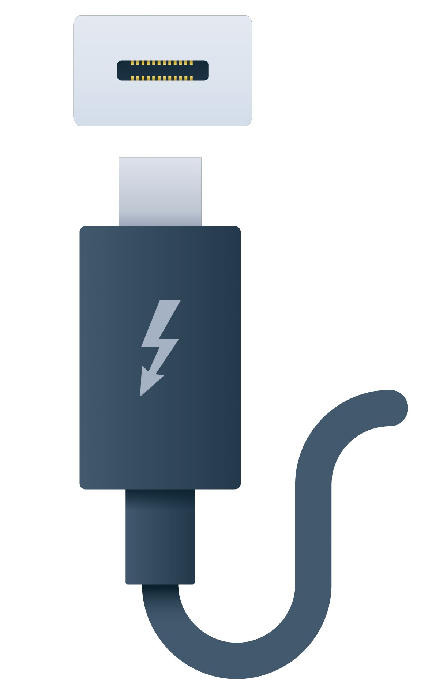

The USB-C form factor adopted for Thunderbolt 3. (Image ©
123RF.com)

</figure>

Thunderbolt version 3 changes the physical interface to use the same
port, connector, and cabling as USB-C. Converter cables are available to
connect Thunderbolt 1 or 2 devices to Thunderbolt 3 ports. A USB device
plugged into a Thunderbolt 3 port will function normally, but
Thunderbolt devices will not work if connected to a USB port that is not
Thunderbolt-enabled. Thunderbolt 3 supports up to 40 Gbps over a short,
high-quality cable (up to 0.5 m/1.6 ft.).

<figure>

Not all USB-C ports support Thunderbolt 3. Look for the flash icon on
the port or confirm using the system documentation. At the time of
writing, converged USB 4 and Thunderbolt 4 standards have been
developed, and products are starting to appear on the market.

</figure>

Lightning Interface

Apple\'s iPhone and iPad mobile devices use a proprietary
[[**Lightning**]{.glossary-term
data-type=""}]{#1ce9f058-3c88-4d61-8718-de70415e16de .gt-note
.definition
note="
 Proprietary connector and interface used by Apple iPhone and iPad devices.
"
ref-id="4e23a98c-f623-42a8-9e25-75db77d719f0"
external-id="84237178-6361-4b45-bfc2-993c192077b8"
gtnote="1696350227032--0.4299075366742866"} port and connector. The
Lightning connector is reversible.

<figure>
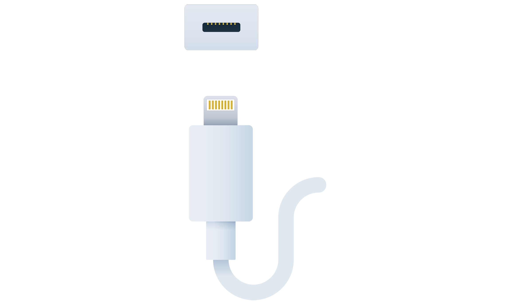

Apple Lightning connector and port. (Image ©123RF.com)

</figure>

The Lightning port is found only on Apple\'s mobile devices. To connect
such a device to a PC, you need a suitable adapter cable, such as
Lightning-to-USB A or Lightning-to-USB C.

SATA Hard Drive Cables

As well as external cabling for peripheral devices, some types of
internal components use cabling to attach to a motherboard port.

Serial Advanced Technology Attachment Interface

[[**Serial Advanced Technology Attachment (SATA)**]{.glossary-term
data-type=""}]{#b7c10d0e-3021-4bb0-9fe0-5673943bc9f8 .gt-note
.definition
note="
 Serial ATA is the most widely used interface for hard disks on desktop and laptop computers. It uses a 7-pin data connector with one device per port. There are three SATA standards specifying bandwidths of 1.5 Gb/s, 3 Gb/s, and 6 Gb/s respectively. SATA drives also use a new 15-pin power connector, though adapters for the old style 4-pin Molex connectors are available. External drives are also supported via the eSATA interface.
"
ref-id="32d97272-4ee0-423d-a7d1-3d3392ac6815"
external-id="c7957604-4c55-43e8-b243-5f2d5b2361bc"
gtnote="1696350263700--0.12603549390593782"} is the standard means of
connecting internal storage drives within a desktop PC. SATA uses cables
of up to 1 m (39 in.) terminated with compact 7-pin connectors. Each
SATA host adapter port supports a single device. 

<figure>

SATA connectors and ports (from left to right): SATA data, SATA power
(with 3.3V orange wire). (Image ©123RF.com)

</figure>

The 7-pin data connector does not supply power. A separate 15-pin SATA
power connector is used to connect the device to the PC's power supply.

The first commercially available SATA standard supported speeds of up to
150 MBps. This standard was quickly augmented by SATA revision 2 (300
MBps) and then SATA revision 3 (600 MBps).

<figure>
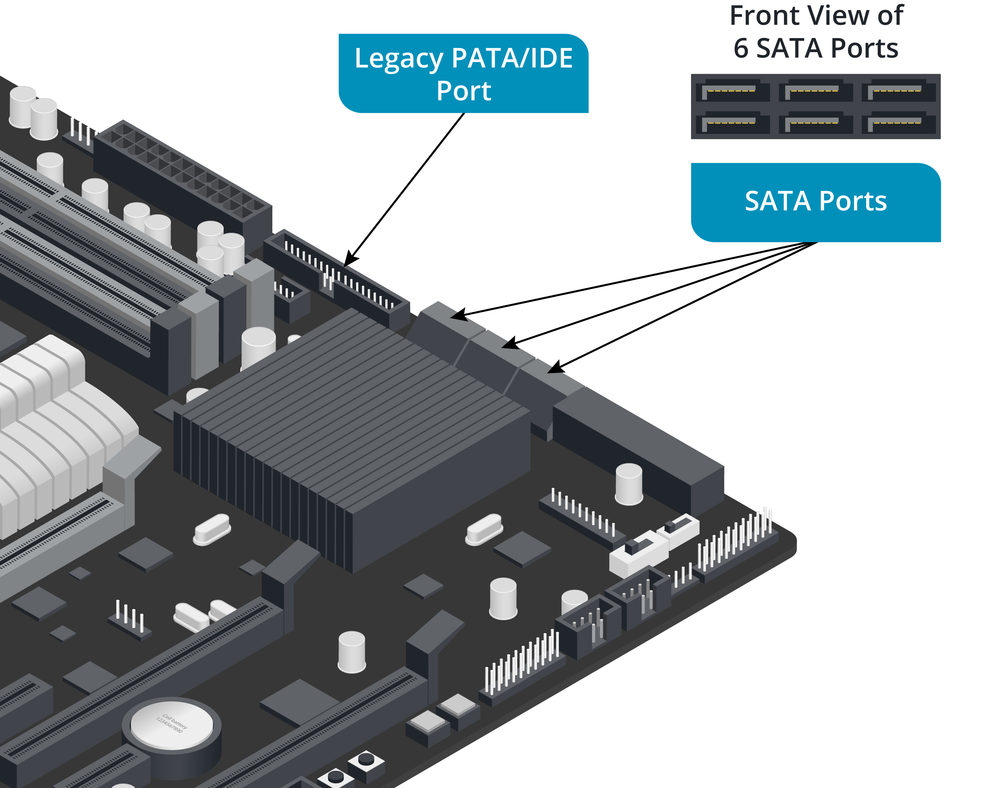

Motherboard SATA and legacy PATA/IDE ports. (Image ©123RF.com)

</figure>

Molex Power Connectors

Internal storage device data cables are unpowered. While the SATA power
connector is the best option for new devices, legacy components connect
to the power supply unit (PSU) via a [[**Molex**
connector]{.glossary-term
data-type=""}]{#44e67881-03ea-4e7d-920d-800cf57bc003 .gt-note
.definition
note="
 Legacy power connector for internal devices such as hard drives and optical drives.
"
ref-id="8a76c5d5-1c40-4042-b2de-1bcd9012351a"
external-id="71e00453-808f-455f-8223-e7eb89f603be"
gtnote="1696350263701--0.004916069814556057"}. A Molex connector is
usually white or clear plastic and has 4 pins. [The color coding of the
wire insulation represents the DC voltage: red (5 VDC), yellow (12 VDC),
and black (ground).]{#hash3b660ae6-22ad-4239-9424-cf4fcd8b990d
.gt-highlight
gt-highlight="{\"characterRange\":{\"start\":1259,\"end\":1375},\"backward\":false,\"id\":\"hash3b660ae6-22ad-4239-9424-cf4fcd8b990d\",\"text\":\"The%20color%20coding%20of%20the%20wire%20insulation%20represents%20the%20DC%20voltage:%20red%20(5%20VDC),%20yellow%20(12%20VDC),%20and%20black%20(ground).\",\"isNote\":false,\"location\":\"1d3759d9-5b35-4e8e-9328-11b11719bd35.html\",\"color\":\"#FFEB6B\",\"style\":\"width:690.9090576171875px; height:500.3692932128906px;\"}"
tabindex="0" role="button"
gt-highlight-id="hash3b660ae6-22ad-4239-9424-cf4fcd8b990d"
style="background-color: rgb(255, 235, 107); margin: 0px; padding: 0px;"
aria-label="Yellow Highlight started. The color coding of the wire insulation represents the DC voltage: red (5 VDC), yellow (12 VDC), and black (ground)., Highlight ended."}

<figure>
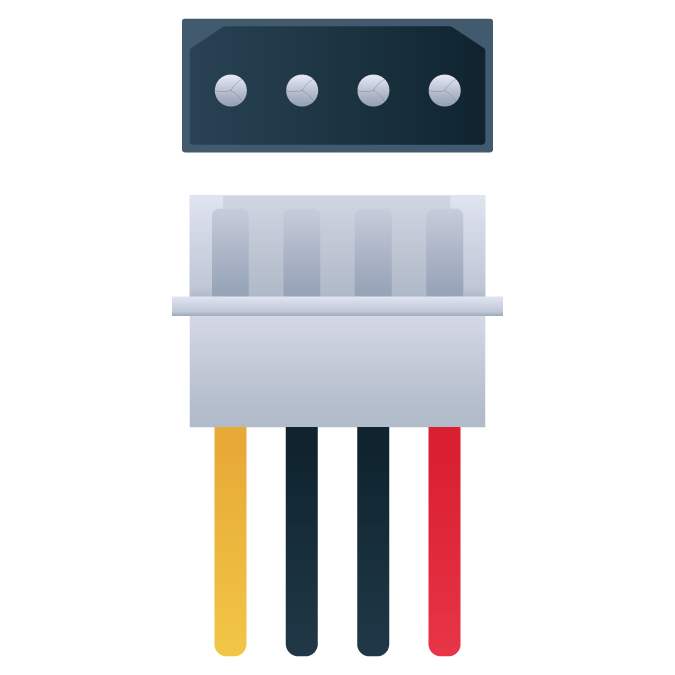

A Molex connector. (Image © 123RF.com)

</figure>

<figure>

Some devices might have both SATA and Molex power connectors.

</figure>

External SATA

There is also an [[**external SATA (eSATA)**]{.glossary-term
data-type=""}]{#628e0419-abe0-484a-a27a-8a2b63be3b5e .gt-note
.definition
note="
 Variant of SATA cabling designed for external connectivity.
"
ref-id="d528b002-c552-4918-8b0c-0ada46752fa4"
external-id="dc4ca820-b183-42d6-99f4-c81fb4bccc1c"
gtnote="1696350263701--0.08464171954794364"}[ standard]{data-type=""}
for the attachment of peripheral drives, with a 2 m (78 in.) cable. You
must use an eSATA cable to connect to an external eSATA port; you cannot
use an internal SATA cable. [eSATAp]{data-type=""} is a nonstandard
powered port used by some vendors that is compatible with both USB and
SATA (with an eSATAp cable). The USB interface dominates the external
drive market, however.

Review Activity: Cable Types and Connectors

<figure>

Answer the following questions:

</figure>

data-id="c3cfeed3-dae0-42d5-a706-bd4f4c3f8a02"}

1.  **A technician has removed an adapter card from a PC. Should the
    technician obtain and install a blanking plate to complete the
    service operation?**

2.  **You are labeling spare parts for inventory. What type of USB
    connector is shown in the exhibit?**

<figure>

(Image ©123RF.com)

</figure>

3.  **What is the nominal data rate of a USB port supporting Gen 3.2
    2x1?**

4.  **True or false? USB-C ports and connectors are compatible with
    Apple Lightning connectors and ports.**

5.  **A technician connects a single port on a graphics card to two
    monitors using two cables. What type of interface is being used?**

6.  **A technician is completing a storage upgrade on an older computer.
    Examining the power supply, the technician notices that only two of
    the five plugs of the type shown in the exhibit are connected to
    devices. What is the purpose of these plugs, and can some be left
    unconnected?**

<figure>

(Image ©123RF.com)

</figure>

Topic 1B

Install and Configure Motherboards

aria-labelledby="ef31a96f-f4ff-4722-9a09-edca440e3520"}

e-pattern-title-default data-id="ef31a96f-f4ff-4722-9a09-edca440e3520"}
CORE 1 EXAM OBJECTIVES COVERED

<figure>

3.4 Given a scenario, install and configure motherboards, central
processing units (CPUs), and add-on cards.

</figure>

The motherboard houses sockets for the devices that implement the core
system functions of a personal computer: compute, storage, and
networking. Knowledge of motherboard types and capabilities plus the
different connector types will enable you to perform component upgrades
and repairs efficiently.

Motherboard Functions

All computer software and data are processed by using the ones and
zeroes of binary code. Software works by running instructions in the
central processing unit (CPU). This can be referred to as the compute or
processing function of a PC.

Instructions and data also require storage. The CPU can only store a
limited number of instructions internally at any one time. Additional
storage for running programs and open data files is provided through
system memory. This random-access memory (RAM) storage technology is
nonpersistent. *Nonpersistent* means that the RAM devices can only hold
data when the PC is powered on. Mass storage devices are used to
preserve data when the computer is turned off.

<figure>
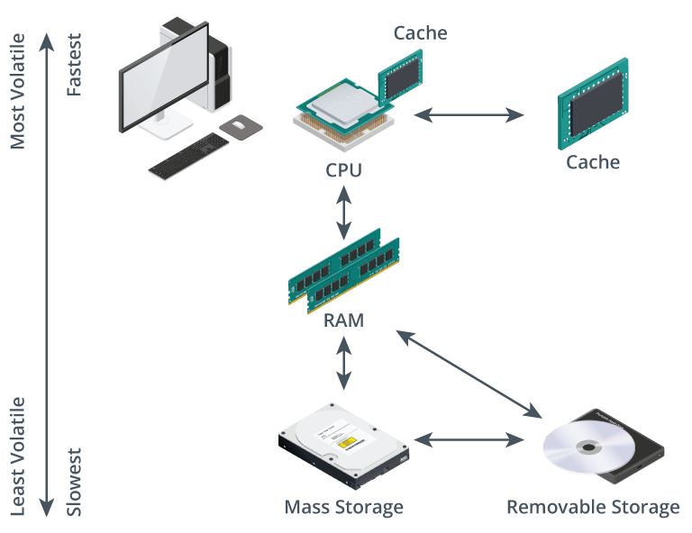

CPU, cache, and RAM are fast but volatile. Mass storage and removable
storage devices provide slower but permanent data retrieval. (Image
©123RF.com)

</figure>

These processing and storage components are connected by bus interfaces
implemented on the motherboard. The instructions and data are stored
using transistors and capacitors and transmitted between components over
the bus using electrical signals.

The motherboard's [system clock]{data-type=""} synchronizes the
operation of all parts of the PC and provides the basic timing signal
for the CPU. Clock speeds are measured in megahertz (MHz) or gigahertz
(GHz). [Clock multipliers take the timing signal produced by the
generator and apply a multiplication factor to produce different timing
signals for different types of
buses]{#hash9fce8c9c-ca53-4a66-810c-5f8aa744e52c .gt-highlight
gt-highlight="{\"characterRange\":{\"start\":1313,\"end\":1478},\"backward\":false,\"id\":\"hash9fce8c9c-ca53-4a66-810c-5f8aa744e52c\",\"text\":\"Clock%20multipliers%20take%20the%20timing%20signal%20produced%20by%20the%20generator%20and%20apply%20a%20multiplication%20factor%20to%20produce%20different%20timing%20signals%20for%20different%20types%20of%20buses\",\"isNote\":false,\"location\":\"46ca7eb5-4727-4728-b04d-a53200eea6b2.html\",\"color\":\"#FFEB6B\",\"style\":\"width:690.9090576171875px; height:500.3692932128906px;\"}"
tabindex="0" role="button"
gt-highlight-id="hash9fce8c9c-ca53-4a66-810c-5f8aa744e52c"
style="background-color: rgb(255, 235, 107); margin: 0px; padding: 0px;"
aria-label="Yellow Highlight started. Clock multipliers take the timing signal produced by the generator and apply a multiplication factor to produce different timing signals for different types of buses, Highlight ended."}.
This means that one type of bus can work at a different speed (or
frequency) to another type of bus.

The type of motherboard influences system speed and the range of system
devices and adapter cards that can be installed or upgraded. There are
many motherboard manufacturers, including AOpen (Acer), ASRock, ASUSTek,
Biostar, EVGA Corporation, Gigabyte, Intel, and MSI. Each motherboard is
designed to support a particular range of CPUs. PC CPUs are principally
manufactured by Intel and Advanced Micro Devices (AMD).

Electrical Safety and ESD

When you open the case to perform upgrades or troubleshooting, you must
follow proper operational procedures to ensure your safety and minimize
the risk of damaging components.

Electrical Safety

When working with a PC, you must ensure your own safety. This means that
the PC must be disconnected from the power supply before opening the
case. Additionally, hold the power button for a few seconds after
disconnecting the power cord to ensure that all internal components are
drained of charge. Do not attempt to disassemble components that are not
field repairable, such as the power supply.

Electrostatic Discharge

You need to use tools and procedures that minimize the risk of damage to
the sensitive electronic components used inside the PC. Components such
as the CPU, system RAM, adapter cards, and the motherboard itself are
vulnerable to electrostatic discharge (ESD). This is where a static
charge stored on your clothes or body is suddenly released into a
circuit by touching it. Handle components by their edges or plastic
parts, and ideally, use an anti-ESD wrist strap and other protective
equipment and procedures.

<figure>

ESD wrist strap on ESD mat. (Image by Audrius Merfeldas ©
123RF.com)

</figure>

<figure>

Operational procedures covering personal safety and the use of
anti-ESD equipment are covered in more detail in the Core 2 course.

</figure>

Motherboard CPU and System Memory Connectors

All motherboards have a variety of **connector types** and socket types
for the system devices: CPU, memory, fixed disk drives, and adapter
cards.

<figure>
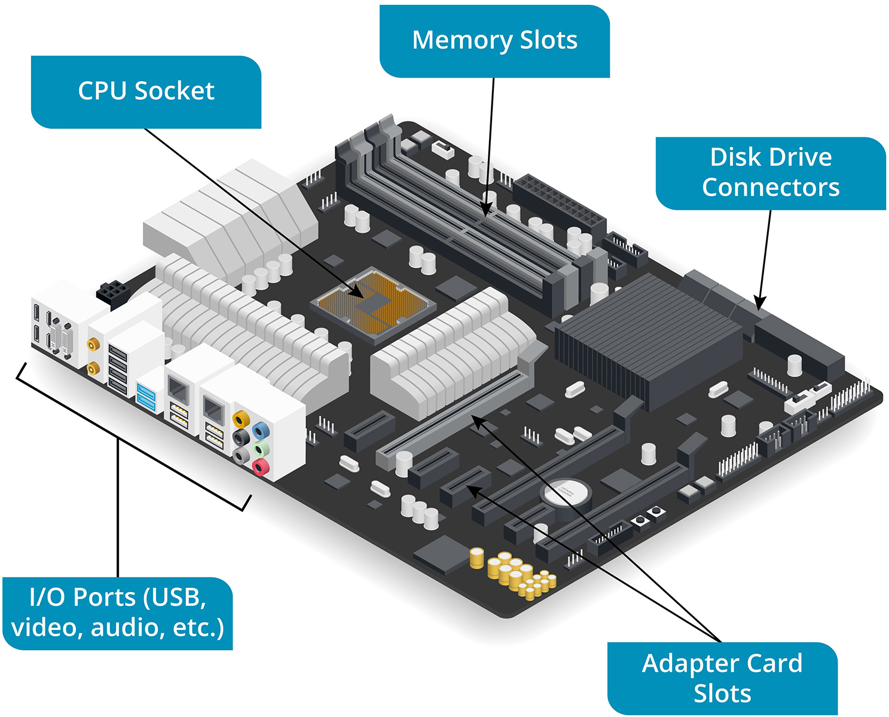

Motherboard connectors. (Image © 123RF.com)

</figure>

CPU Sockets

New motherboards are generally released to support the latest CPU
models. Most PC CPUs are manufactured by Intel and AMD, and these
vendors use different socket designs. Because CPU technology changes
rapidly, a given motherboard will only support a limited number of
processor models.

The CPU socket has a distinctive square shape. When the CPU has been
installed, it is covered by a heat sink and fan.

The function of the CPU is supported by the motherboard's chipset. This
consists of controllers that handle the transfer of data between the CPU
and various devices. The chipset is soldered onto the motherboard and
cannot be upgraded. The type of chipset on the motherboard determines
the choice of processor; the type and maximum amount of RAM; and support
for integrated interfaces/ports, such as video, sound, and networking.
Interfaces that are not supported by the chipset can be installed or
upgraded as an adapter card.

System Memory Slots

System memory uses a type of memory technology called random-access
memory (RAM). Program code is loaded into RAM so that it can be accessed
and executed by the processor. RAM also holds data, such as the contents
of a spreadsheet or document, while it is being modified. System RAM is
volatile; it loses its contents when power is removed.

System RAM is normally packaged as a dual inline memory module (DIMM)
fitted to a motherboard slot. A DIMM slot has catches at either end, is
located close to the CPU socket, and is numbered and often color-coded.
There are successive generations of RAM technologies, such as DDR3,
DDR4, and DDR5. A DIMM form factor is specific to a particular DDR
version. A label next to the slots should identify the type of DIMMs
supported.

The capabilities of the memory controller and number of physical slots
determine how much memory can be fitted.

Motherboard Storage Connectors

One or more fixed disks installed inside the PC case provide persistent
storage for the operating system, software programs, and data files.
Fixed disks use either solid state drive (SSD) or hard disk drive (HDD)
technology.

Serial Advanced Technology Attachment Interface

The motherboard will contain several Serial Advanced Technology
Attachment (SATA) ports to connect one or more fixed drives. SATA can
also be used to connect removable drives, such as tape drives and
optical drives (DVD/Blu-ray). SATA devices are installed to a drive bay
in the chassis and then connected to a data port via a cable and to the
power supply via a SATA power or Molex connector.

M.2 Interface

An SSD can be provisioned in an adapter card form factor. These often
use an M.2 interface. An M.2 port is oriented horizontally. The adapter
card is inserted at an angle and then pushed into place and secured with
a screw. M.2 adapters can be different lengths (42 mm, 60 mm, 80 mm, or
110 mm), so you should check that any given adapter will fit on your
motherboard. Labels indicate the adapter sizes supported. M.2 supplies
power over the bus, so there is no need for a separate power cable.

<figure>
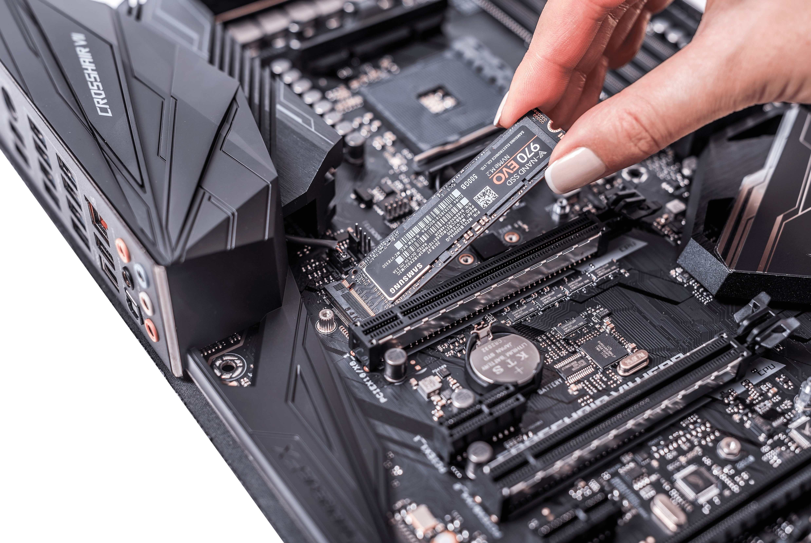

M.2 form factor SSD being inserted into a motherboard connector.
(Image ©123RF.com)

</figure>

External SATA Interface

There is also an external SATA (eSATA) standard for the attachment of
external drives, with a 2 m (78 in.) cable. You must use an eSATA cable
to connect to an external eSATA port; you cannot use an internal SATA
cable. eSATAp is a nonstandard powered port used by some vendors that is
compatible with both USB and SATA (with an eSATAp cable). 

<figure>

The
main drawback of eSATA compared to USB or Thunderbolt external drives is
that power is not supplied over the cable. This is not so much of
an issue for 3.5-inch drives, which require a separate power supply, but
it limits the usefulness of eSATA for 2.5-inch portable drives.

</figure>

Motherboard Adapter Connectors

Expansion slots accept plug-in adapter cards to extend the range of
functions the computer can perform. There are two main types of
expansion slot interface.

Peripheral Component Interconnect Express Interface

The [[**Peripheral Component Interconnect Express
(PCIe)**]{.glossary-term
data-type=""}]{#5d15f71f-f200-45dc-956c-a25e4dc9e904 .gt-note
.definition
note="
 Internal expansion bus that uses serial point-to-point communications between devices. Each link can comprise one or more lanes (x1, x2, x4, x8, x12, x16, or x32). Each lane supports a full-duplex transfer rate of 250 MB/s (v1.0) up to about 4 GB/s (v5.0).
"
ref-id="130eef2c-8ac1-4bf7-a9b8-a5df96056fe3"
external-id="b290ea28-8289-46f8-bce0-3d90e1e79c7b"
gtnote="1696350499800--0.12075491029142471"} bus is the mainstream
interface for modern adapter cards. It uses point-to-point serial
communications, meaning that each component can have a dedicated link to
any other component.

<figure>
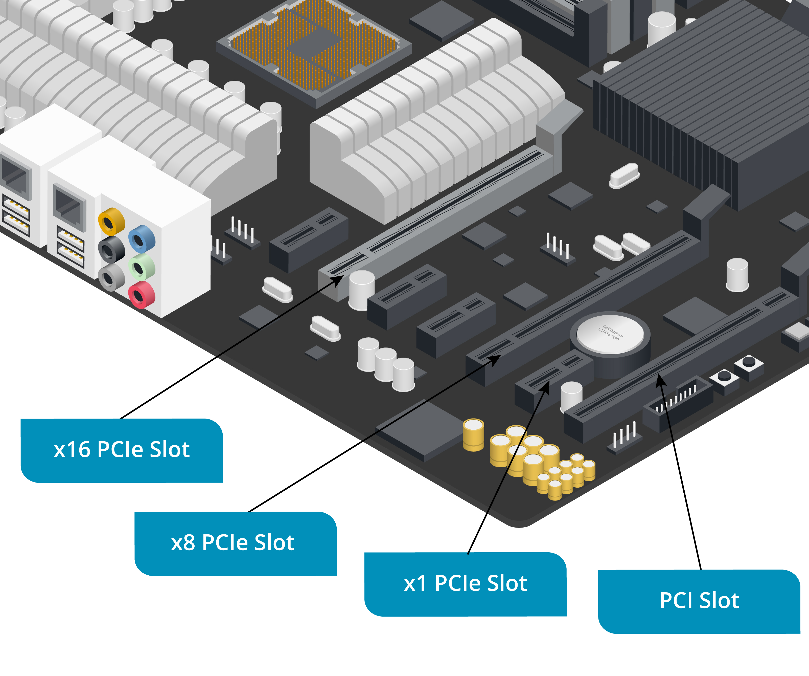

Motherboard PCI and PCI Express expansion slots. (Image
©123RF.com)

</figure>

Each point-to-point connection is referred to as a link. Each link can
make use of one or more lanes. The raw transfer rate of each lane
depends on the PCIe version supported. Transfer rates are measured in
gigatransfers per second (GT/s). Throughput in GB/s is the rate achieved
after loss through encoding is accounted for.

data-id="327670d1-dbc4-432a-8289-60e964aa5e0c"}

<figure>
<table class="gt-table e-table-default">
<colgroup>
<col style="width: 25%" />
<col style="width: 25%" />
<col style="width: 25%" />
<col style="width: 25%" />
</colgroup>
<thead>
<tr class="header">
<th class="vertical-align-middle">
Version
</th>
<th class="vertical-align-middle">
GT/s
</th>
<th class="vertical-align-middle">
GB/s for x1
</th>
<th class="vertical-align-middle">
GB/s for x16
</th>
</tr>
</thead>
<tbody>
<tr class="odd">
<td class="vertical-align-middle">
2
</td>
<td class="vertical-align-middle">
5
</td>
<td class="vertical-align-middle">
0.5
</td>
<td class="vertical-align-middle">
8
</td>
</tr>
<tr class="even">
<td class="vertical-align-middle">
3
</td>
<td class="vertical-align-middle">
8
</td>
<td class="vertical-align-middle">
0.985
</td>
<td class="vertical-align-middle">
15.754
</td>
</tr>
<tr class="odd">
<td class="vertical-align-middle">
4
</td>
<td class="vertical-align-middle">
16
</td>
<td class="vertical-align-middle">
1.969
</td>
<td class="vertical-align-middle">
31.508
</td>
</tr>
<tr class="even">
<td class="vertical-align-middle">
5
</td>
<td class="vertical-align-middle">
32
</td>
<td class="vertical-align-middle">
3.938
</td>
<td class="vertical-align-middle">
63.015
</td>
</tr>
</tbody>
</table>
</figure>

Adapter slots with more lanes are physically longer. Each PCIe adapter
card supports a specific number of lanes, typically x1, x4, x8, or x16.
Ideally, the card should be plugged into a port that supports the same
number of lanes. However, if insufficient slots are available, a card
will fit in any port with an equal or greater number of lanes. This is
referred to as up-plugging. For example, a x8 card will fit in a x8 or
x16 socket. The card should work at x8 but in some circumstances may
only work at x1.

It may also be possible to fit a longer card into a shorter slot,
referred to as down-plugging, so long as the card is not obstructed by
other features in the case.

<figure>

A slot may support a lower number of lanes than its physical size
suggests. The number of lanes supported by each slot is indicated by a
label on the motherboard. For example, a slot that is physically x16 but
supports only x8 operation will be labelled x16/x8 or x16 @ x8.

</figure>

All PCIe versions are backwards-compatible. For example, you can connect
a PCIe version 2 adapter to a version 4 motherboard or install a version
3 adapter into a version 2 motherboard. The bus works at the speed of
the lowest version component.

PCIe can supply up to 75W to a graphics card via a dedicated graphics
adapter slot and up to 25W over other slots. An extra 75W power can be
supplied via a PCIe power connector. 

Peripheral Component Interconnect Interface

Computers can support more than one expansion bus, often to support
older technologies. [[**Peripheral Component Interconnect
(PCI)**]{.glossary-term
data-type=""}]{#6df022ea-c90f-418a-b536-00c27f94a6ea .gt-note
.definition
note="
 Legacy internal expansion bus supporting 32-bit parallel transfers working at 33 MHz.
"
ref-id="0915143f-ae63-4e04-8698-73927c94da17"
external-id="77ca8915-fafe-4a34-b617-730028b02ca3"
gtnote="1696350499801--0.22861854456781905"} is a legacy bus type,
having been superseded by PCI Express. PCIe is software compatible with
PCI, meaning that PCI ports can be included on a PCIe motherboard to
support legacy adapter cards, but PCI cards cannot be fitted into PCIe
slots.

As with many legacy technologies, PCI uses parallel communications. Most
types of PCI are 32-bit and work at 33.3 MHz, achieving a transfer rate
of up to 133 MBps (that is, 32 bits divided by 8 to get 4 bytes, then
multiplied by the clock rate of 33.3). The earliest PCI cards were
designed for 5V signaling, but 3.3V and dual voltage cards became more
prevalent. To prevent an incompatible PCI card from being inserted into
a motherboard slot (for example, a 3.3V card in a 5V PCI slot), the
keying for the three types of cards is different.

<figure>
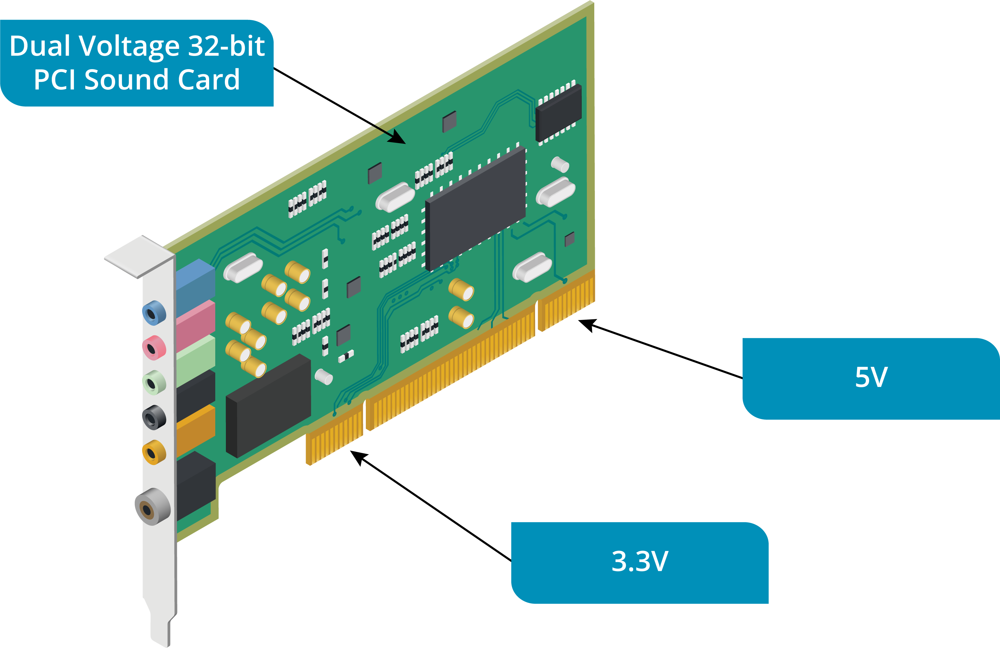

32-bit PCI sound card with dual voltage. (Image ©123RF.com)

</figure>

Motherboard Form Factors

The **motherboard form factor** describes its shape, layout, and the
type of case and power supply that can be used, plus the number of
adapter cards that can be installed. 

Advanced Technology eXtended Form Factor

The [[**Advanced Technology Extended (ATX)**]{.glossary-term
data-type=""}]{#ba396da3-4859-4946-97c2-e7822072d47a .gt-note
.definition
note="
 Standard PC case, motherboard, and power supply specification. Mini-, Micro-, and Flex-ATX specify smaller board designs.
"
ref-id="fe0ba9a8-38c4-4bd5-9bf1-57f03b84f842"
external-id="c1205c55-9914-4de9-8bb8-5e21f8d93a33"
gtnote="1696350591571--0.6787707255431457"} specification is the
standard form factor for most desktop PC motherboards and cases.
Full-size ATX boards are 12 inches wide by 9.6 inches deep (or 305 mm x
244 mm). An ATX board can contain up to seven expansion slots.

The Micro-ATX (mATX) standard specifies a 9.6-inch (244 mm x 244 mm)
square board. mATX boards can have a maximum of four expansion slots.

<figure>

Most mATX boards can be mounted in ATX cases.

</figure>

Information Technology eXtended Form Factor

Small form factor (SFF) PCs are popular as home machines and for use as
mini servers. SFF PCs often use Via\'s Mini-ITX ([[**Information
Technology Extended**]{.glossary-term
data-type=""}]{#5bd9f2a5-d334-4d67-a857-9d2905bfb56e .gt-note
.definition
note="
 Series of motherboard form factors designed for small form factor (SFF) computers and appliances.
"
ref-id="9e103e4c-5e10-4af2-a359-782535702120"
external-id="42060b8b-a609-4f72-8374-87cc015b8d3c"
gtnote="1696350591571--0.45730767078046086"}) form factor.

Mini-ITX is 6.7 inches (170 mm x 170 mm) square with one expansion slot.
These are designed for small cases, but do note that most mini-ITX
boards can be mounted in ATX cases. There are also smaller nano-, pico-,
and mobile-ITX form factors, but these are used for embedded systems and
portables, rather than PCs.

<figure>

No commercial motherboards were ever produced from the original plain
ITX specification.

</figure>

Motherboard Installation

The motherboard is attached to the case by using standoffs. These hold
the motherboard firmly and ensure no other part of it touches the case.
The standoffs are positioned in holes that line up in the same position
in the case and the motherboard if they use compatible form factors.

The general procedure for installing a motherboard is as follows:

1.  Use the motherboard documentation to familiarize yourself with the
    specific installation procedure. Check whether any jumper clips need
    to be adjusted. A jumper is placed over header pins in a particular
    orientation. For example, there might be a jumper that enables
    recovery mode.

<figure>

The motherboard is vulnerable to electrostatic discharge (ESD).
Always take anti-ESD precautions when handling and storing these
devices.

</figure>

1.  Orient the board to the oblong I/O cut out at the rear of the case.
    Prepare the motherboard I/O blanking plate in the correct
    orientation by removing caps so that USB, audio, and video ports
    will be uncovered when the board is fitted. Fit the blanking plate
    to the case by snapping it into the cut out.
2.  Insert standoffs into the case to match the hole locations on the
    motherboard. Standoffs are usually threaded, though older cases
    might use push-down pegs. There might be a guide standoff attached
    to the case or all standoffs might come preinstalled. Make sure that
    corners, long edges, and the center of the board will be supported.
    Do not add standoffs where there is no corresponding hole on the
    motherboard.
3.  Optionally, add the CPU and memory modules to the motherboard before
    installing the board in the case.
4.  Check the alignment and standoff location again and verify that each
    standoff is secure. If everything is correct, place the motherboard
    on the standoffs.

<figure>
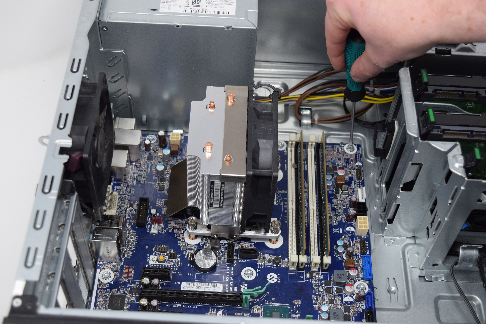

Align the board with the I/O cut out (top left) and ensure that it is
supported by standoffs at the edges and in the center. (Image courtesy
of CompTIA.)

</figure>

6.  Secure each standoff using the appropriate screw type. Make sure
    that the board is firm and stable, but do not overtighten the screws
    or you risk cracking the board.
7.  To complete PC installation, add the power and disk devices to the
    case, install any add on adapter cards to the motherboard, and
    install the data and power connectors.

<figure>

Selection and installation of power, disk, system memory, and CPU
devices are covered in detail in the next lesson.

</figure>

Motherboard Headers and Power Connectors

In addition to slots and sockets for system devices, motherboards also
include connectors for components such as case buttons, speakers, and
fans.

<figure>
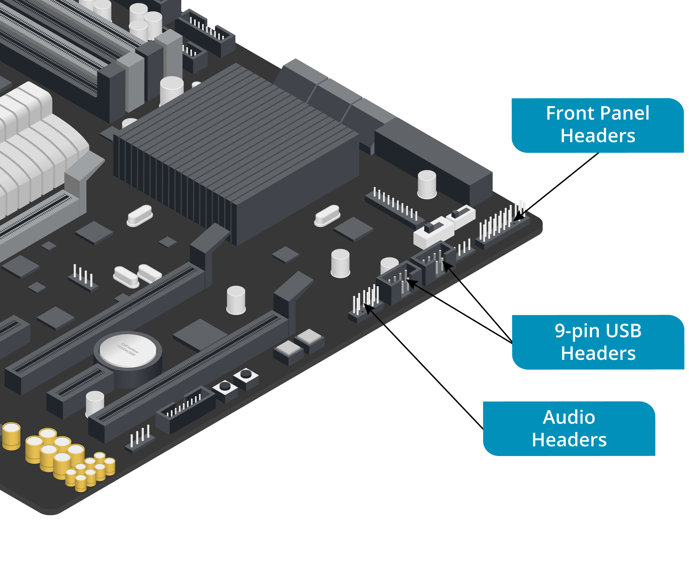

Motherboard front panel, USB, and audio headers. (Image
©123RF.com)

</figure>

Headers

Components on the front and rear panels of the case connect to
[[**headers**]{.glossary-term
data-type=""}]{#a6e9daa4-8566-4507-bb91-f6b9866afd3c .gt-note
.definition
note="
 Connector on the motherboard for internal cabling, such as fan power and front panel ports and buttons.
"
ref-id="50da0f19-38d4-4166-8bfd-7beccf7d46a0"
external-id="cd4616f6-ca8d-48fe-b86c-5e96fb2f2690"
gtnote="1696350619986--0.7769965196037796"} on the motherboard:

-   **Power button (soft power)**---Sends a signal that can be
    interpreted by the OS as a command to shut down rather than
    switching the PC off. Holding down the power button for a few
    seconds will cut the power, however.
-   **Drive (HDD) activity lights**---Show when an internal hard disk is
    being accessed.
-   **Audio ports**---Allow speakers and/or headphones and a microphone
    to be connected to the computer.
-   **USB ports**---Internal USB 2 connections are made via 9-pin
    headers, which accept up to two 4-pin port connections (the 9th pin
    is to orient the cable correctly). USB 3 headers use a 2x10 format
    and can be cabled to two ports.

When disassembling the system, you should make a diagram of the position
and orientation of header connectors. If you do not have a diagram, you
will have to refer to the motherboard documentation or go by any labels
printed on the wires and headers. These are not always very easy to
follow, however.

Power Connectors

The motherboard also contains various connection points for the power
supply and fans.

-   The main P1 motherboard **power connector** is a distinctive 2-pin x
    12-pin block with square pin receptacles.
-   Fan connectors are 3- or 4-pin Molex KK format. There will be one
    for the CPU and one or more for the case fans and components such as
    memory and video adapters. 4-pin fan connectors support precise
    fan-speed control via a [pulse width modulation (PWM)
    ] signal carried by the blue wire. 3-pin fans are controlled by varying the voltage.

<figure>

Fans with a 3-pin connector can usually be used with 4-pin headers,
but the system may not be able to vary the fan speed (or may need
special configuration to be able to do so). A fan with a 4-pin connector
will usually work with a 3-pin header but will not be able to use
PWM.

</figure>

Video Cards and Capture Cards

An **expansion card** adds functions or ports that are not supported by
the integrated features of the motherboard. An expansion card can be
fitted to an appropriate PCIe or PCI slot. Some of the main types of
expansion card are sound, video, capture, and network. 

Video Cards

The [[**video card**]{.glossary-term
data-type=""}]{#48ecb3b5-e8db-4713-83ac-ef8a4aff0a9b .gt-note
.definition
note="
 Adapter that handles graphics processing and output to a display device over one or more video interface ports.
"
ref-id="20b82700-baaa-48a6-a707-be15b590658b"
external-id="0781299b-ae7e-4d46-9bcf-38f2d10aa218"
gtnote="1696350659828--0.07497302309291709"} (or graphics adapter)
generates the signal to drive a monitor or projector. Low-end graphics
adapters are likely to be included with the motherboard chipset or as
part of the CPU itself. This is also referred to as an onboard adapter
or onboard graphics. If a computer is to be used for 3-D gaming,
computer-aided design (CAD), or digital artwork, a more powerful video
adapter is required. This can be installed as an add-on card via a PCIe
slot. Most graphics adapters are based on chipsets by ATI/AMD, NVIDIA,
and Intel. Video cards are distinguished by the following features:

-   **Graphics Processing Unit (GPU)**---A microprocessor designed and
    optimized for processing instructions that render 2-D and 3-D images
    and effects on-screen. The basic test for a GPU is the frame rate it
    can produce for a particular game or application. Other performance
    characteristics include support for levels of texture and lighting
    effects.
-   **Graphics memory**---3-D cards need a substantial amount of memory
    for processing and texture effects. A dedicated card may be fitted
    with up to 12 GB GDDR RAM at the high end; around 4--6 GB would be
    more typical of current mid-range performance cards. Low-end cards
    use shared memory (that is, the adapter uses the system RAM). Some
    cards may use a mix of dedicated and shared memory.
-   **Video ports**---The type and number of connectors, such as HDMI,
    DisplayPort, and Thunderbolt. 

<figure>

Graphics Double Data Rate (GDDR) memory technology is similar to the
DDR modules used for system RAM.

</figure>

Most modern cards use a PCIe x16 interface. Dual cards, using two (or
more) slots, are also available. 

<figure>
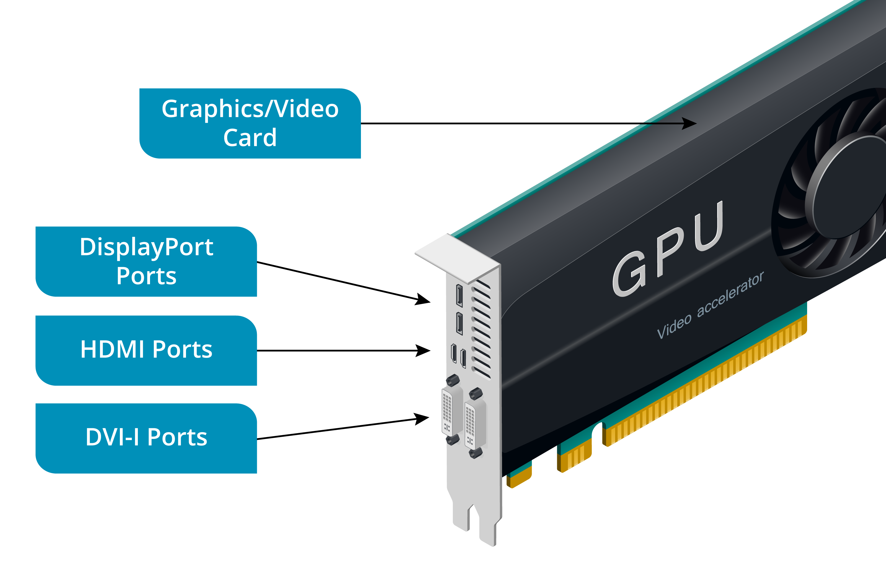

A video/graphics card with DisplayPort, HDMI, and DVI-I ports. (Image
©123RF.com)

</figure>

Capture Cards

Where a graphics card generates an output video signal to drive a
monitor, a [**capture card**]{#cda57003-cc81-450f-a1cf-7e4283733ce6
.gt-note .definition
note="
 Adapter card designed to record video from a source such as a TV tuner or games console.
"
ref-id="7a2f5247-359c-4958-b16a-1d9f18a7d519"
external-id="c714ab00-671b-4e7f-9a88-22daec43d0f9"
gtnote="1696350659828--0.7299913041226718"} is used to record video
input and save it as a type of movie or streaming media file. Many
capture cards are designed to record footage from computer games. Some
are designed to work with PC games, while others record from game
console HDMI sources or from a live camera HDMI source, such as a
camcorder or security camera. Another class of capture card can act as a
TV tuner and record video from broadcast TV sources.

A capture card can be fitted as an internal PCIe or as an external unit
connected via USB/Thunderbolt.

Sound Cards

Audio playback is achieved via speakers or headphones, which are
connected to a [[**sound card**]{.glossary-term
data-type=""}]{#67c44c33-09c9-4f17-ba75-5fde4ea97028 .gt-note
.definition
note="
 Adapter card providing sound playback and recording functionality. A number of different audio ports exist on modern computer motherboards or on specialist sound cards. Commonly, audio ports may be marked as: audio out, audio in, speaker out, microphone input/mic, and headphones.
"
ref-id="c3ce23de-5f61-4187-b24e-7327eb8ff37d"
external-id="af765b40-b6e6-4073-a118-0809c67cefde"
gtnote="1696350732374--0.202867191846271"} via an audio jack. Sound
cards are also used to record input from a microphone. Most audio jacks
are 3.5 mm (⅛ inch) mono or stereo jacks. These are also referred to as
phone plugs or mini tip, ring, sleeve (TRS) connectors.

<figure>
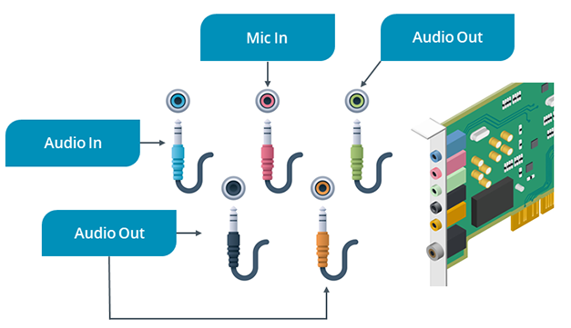

Audio jacks on a sound card. (Image ©123RF.com)

</figure>

Sound cards supporting multiple output channels with an appropriate
speaker system can provide various levels of playback, from mono (on
legacy systems) or stereo to some type of surround sound. Surround sound
uses multiple speakers positioned around the listener to provide a
\"cinematic\" audio experience.

A basic sound chip may be provided as part of the motherboard chipset,
but better-quality audio functions can be provided as a PCIe or PCI
expansion card. Pro-level cards may also feature onboard memory, flash
memory storing sound samples (wavetables), and additional jack types for
different input sources.

<figure>

Audio hardware built into a computer may be susceptible to noise from
other internal components when using recording functionality.
Consequently, most audio interfaces designed for professional use are
external units connected via USB or Thunderbolt.

</figure>

Network Interface Cards

Most computers have an Ethernet network adapter already installed as
part of the motherboard chipset. However, there may be occasions when
you need to install an add-on [[**network interface card
(NIC)**]{.glossary-term
data-type=""}]{#4481d15e-64b9-4b38-ba78-24233c8ca1b2 .gt-note
.definition
note="
 Adapter card that provides one or more Ethernet ports for connecting hosts to a network so that they can exchange data with one another.
"
ref-id="0d00a58a-7a7a-4b72-b07f-55a83e73fea7"
external-id="4b7ab74e-2adf-4a22-a1cd-26604e3db173"
gtnote="1696350764062--0.04103207532013409"} or need to upgrade an
adapter to use a different type of network or cabling/connector, such as
copper cable versus fiber optic. A dedicated NIC may also provision
multiple ports. These can be bonded into a single higher bandwidth link.

<figure>

RJ45 ports on a Network Interface Card (NIC). (Image ©123RF.com)

</figure>

A Wi-Fi adapter can be added to connect to a wireless network. Wi-Fi
adapters are developed to different 802.11 standards. There are also
cards that can connect to cellular data networks.

Review Activity: Motherboards

<figure>

Answer the following questions:

</figure>

data-id="01bd5c4b-7ed4-4fd7-a45d-a374caa900b9"}

1.  **What type of motherboard socket is used to install system
    memory?**

2.  **How many storage devices can be attached to a single SATA port?**

3.  **What is the bandwidth of a PCIe v2.0 x16 graphics adapter?**

4.  **You have a x8 PCIe storage adapter card---can you fit this in a
    x16 slot?**

5.  **You are labeling spare parts for inventory. What type of
    motherboard is displayed here?**

<figure>
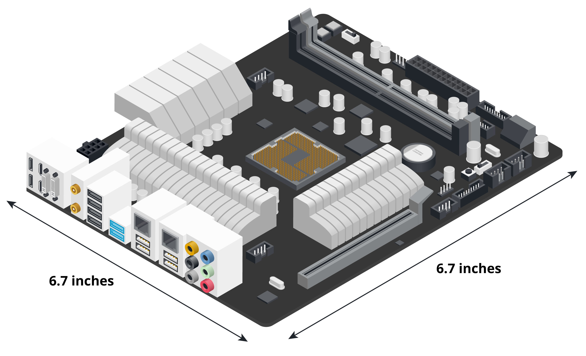

(Image ©123RF.com)

</figure>

6.  **You have another part to label for inventory. What category of
    adapter card is shown in the exhibit?**

<figure>
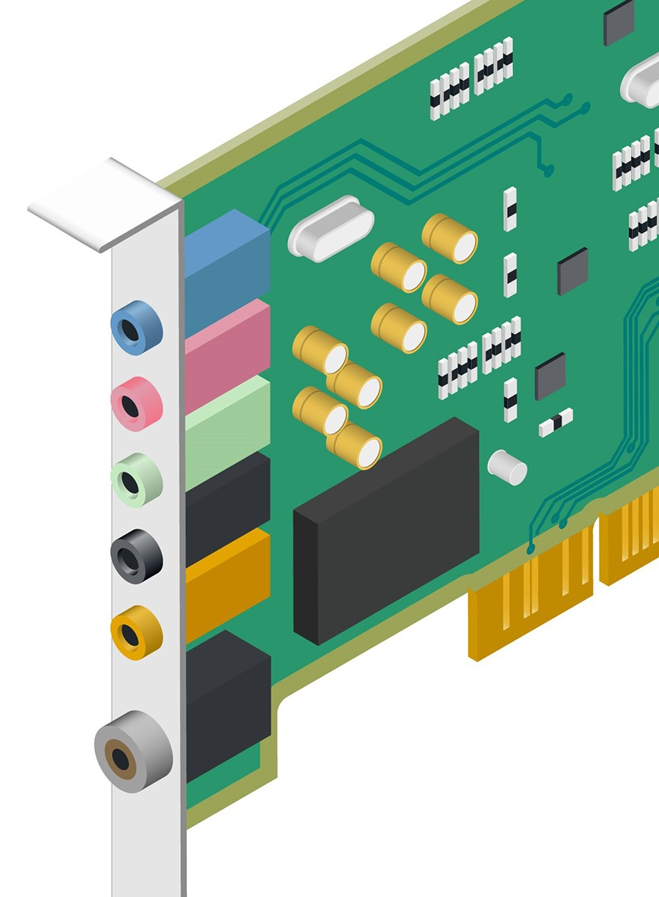

(Image ©123RF.com)

</figure>

Review Activity: Motherboards

<figure>

Answer the following questions:

</figure>

data-id="01bd5c4b-7ed4-4fd7-a45d-a374caa900b9"}

1.  **What type of motherboard socket is used to install system
    memory?**

2.  **How many storage devices can be attached to a single SATA port?**

3.  **What is the bandwidth of a PCIe v2.0 x16 graphics adapter?**

4.  **You have a x8 PCIe storage adapter card---can you fit this in a
    x16 slot?**

5.  **You are labeling spare parts for inventory. What type of
    motherboard is displayed here?**

<figure>

(Image ©123RF.com)

</figure>

6.  **You have another part to label for inventory. What category of
    adapter card is shown in the exhibit?**

<figure>

(Image ©123RF.com)

</figure>

DVI and VGA Video Cables

The HDMI and DisplayPort video interfaces only support digital
flat-panel displays. Older video interfaces were used when computer
monitors and projectors were predominantly of the cathode ray tube (CRT)
type, driven by an analog signal.

Digital Visual Interface

[[**Digital Visual Interface (DVI)**]{.glossary-term
data-type=""}]{#8af90849-890d-4635-8359-d2e829c4beb9 .gt-note
.definition
note="
 Legacy video interface that supports digital only or digital and analog signaling.
"
ref-id="fc9ef4cb-1a1b-49b1-834e-83c4e3282523"
external-id="83806a91-f597-415b-bb08-4a3f0e396618"
gtnote="1696350887829--0.35858799910432704"} is designed to support both
analog and digital outputs. While popular for a period after its
introduction in 1999, DVI is no longer in active development. You are
only likely to encounter DVI on older display devices and video cards.

There are five types of DVI, supporting different configurations for
single and dual link (extra bandwidth) and analog/digital output
signaling. The pin configuration of the connectors identifies what type
of DVI is supported by a particular port.

<figure>
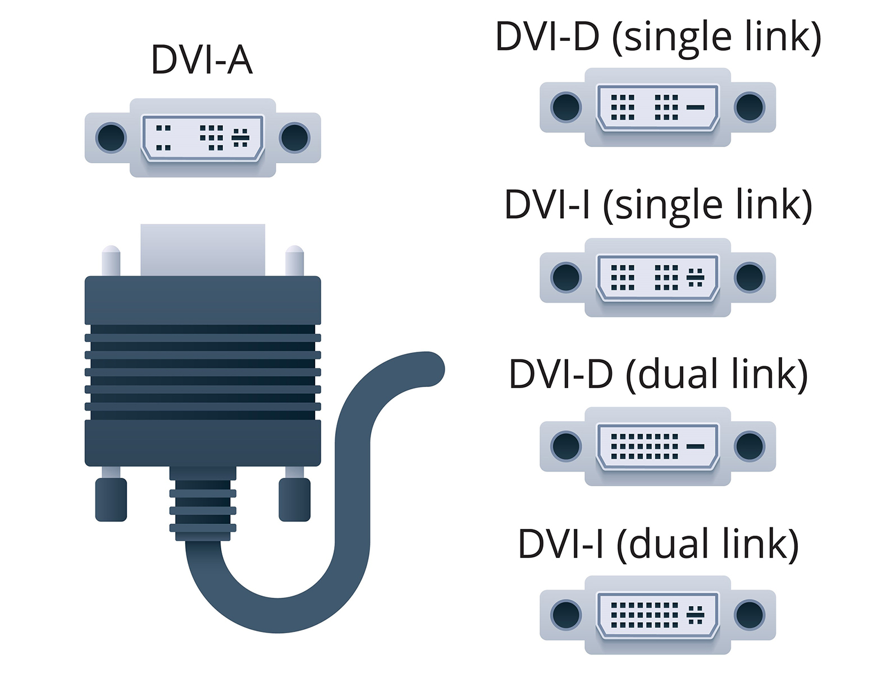

DVI port and connector types. (Image ©123RF.com)

</figure>

DVI-I supports both analog equipment and digital outputs. DVI-A supports
only analog output and DVI-D supports only digital.

Video Graphics Array Interface

The 15-pin [[**Video Graphics Array (VGA)**]{.glossary-term
data-type=""}]{#8604a0c9-30c1-42bf-ba17-bc48f63e2010 .gt-note
.definition
note="
 Legacy video interface supporting analog-only signaling over a 15-pin D-shell connector.
"
ref-id="4e5706ae-c99b-45aa-be63-add3eaede8b6"
external-id="8d194c78-3cf0-4d59-b0a5-d7bf099767db"
gtnote="1696350887829--0.9962208180997423"} port was the standard analog
video interface for PC devices for a very long time. Up until a few
years ago, most video cards and monitors included a VGA port, though it
is starting to be phased out completely now. VGA will usually support
resolutions up to HD (1920x1080), depending on cable quality. The
connector is a D-shell type with screws to secure it to the port.

<figure>
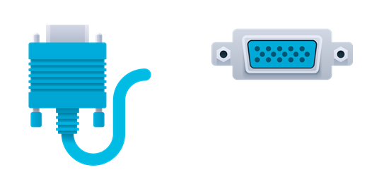

A VGA connector and port. (Image ©123RF.com)

</figure>

Small Computer System Interface

Modern bus interfaces such as USB and Thunderbolt use serial
communications. These serial links can achieve Mbps and Gbps speeds
through the use of improved signaling and encoding methods. Back when
serial interfaces were much slower, PC vendors used parallel data
transmission to support better transfer rates. While a serial interface
essentially transfers 1 bit at a time, a parallel interface transfers 8
bits (1 byte) or more. This requires more wires in the cable and more
pins in the connectors, meaning parallel interfaces are bulky.

[[**Small computer system interface (SCSI)**]{.glossary-term
data-type=""}]{#ccd9945f-e9bd-4a52-bc01-6d21e3d89eee .gt-note
.definition
note="
 Legacy expansion bus standard allowing for the connection of internal and external devices. Each device on a SCSI bus must be allocated a unique ID. The bus must also be terminated at both ends.
"
ref-id="3f6b20a9-1112-435d-8b18-31f689a0cf37"
external-id="c31beaf3-2f14-4b08-b3c4-8afb002f564a"
gtnote="1696350921201--0.7223169967204277"} is one example of a legacy
parallel bus. One SCSI host bus adapter (HBA) can control multiple
devices attached by internal ribbon cables or external SCSI cables. The
SCSI standard also defines a command language that allows the host
adapter to identify which devices are connected to the bus and how they
are accessed.

SCSI could be used for both internal devices and external peripherals,
such as scanners and printers, but you are now unlikely to find it used
for any purpose other than the connection of internal hard disk drives.
SCSI could support data rates up to 320 MBps. There have been numerous
versions of SCSI with many different physical connectors, but you are
only likely to come across high density (HD) 68-pin connectors or single
connector attachment (SCA) 80-pin connectors. SCA incorporates a power
connector, while HD-68 is used with Molex power connectors.

<figure>
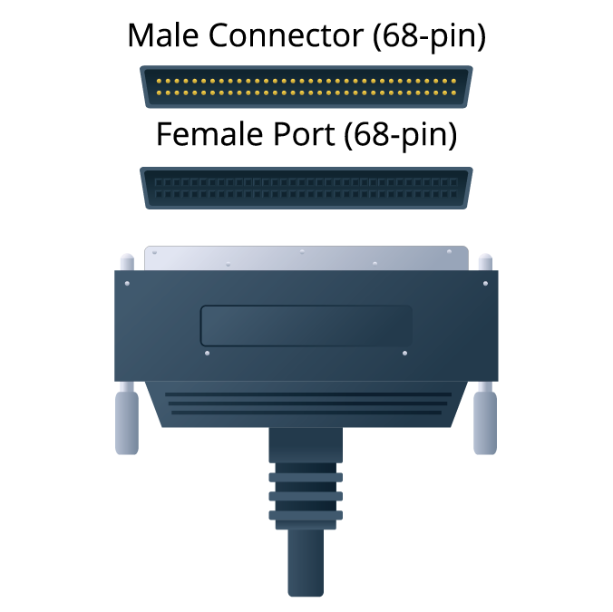

Internal and external male HD connectors. (Image ©123RF.com)

</figure>

Each device on a wide SCSI bus must be configured with a unique ID, from
0 to 15. The host adapter is usually set to 7 or 15. A bootable hard
disk is usually allocated ID 0. The first and last devices on a SCSI bus
must be terminated. Termination may either be enabled internally on the
device by setting a switch or by physically connecting a terminator pack
to a device or the host adapter.

Additionally, you should note that while parallel SCSI as a physical
interface has almost completely disappeared, the software interface and
command set are used in many other storage technologies, including
serial attached SCSI (SAS). SAS is a dominant interface for
enterprise-class storage devices in the PC workstation and server
market. 

Integrated Drive Electronics Interface

The [[**integrated drive electronics (IDE)**]{.glossary-term
data-type=""}]{#acbbbf16-aaef-4efb-b45c-3534f518cf18 .gt-note
.definition
note="
 Legacy mass storage bus, most commonly implemented as extended IDE (EIDE) and also referred to as parallel advanced technology attachment (PATA). Each IDE controller port supports two devices connected over ribbon cable with three connectors (controller, primary device, and secondary device).
"
ref-id="f3419439-d083-43dc-8750-c11be0a77a5f"
external-id="603e63b6-26e4-4235-903a-8bb0561eb715"
gtnote="1696350958290--0.037990732685382334"} interface was the
principal mass storage interface for desktop PCs for many years. The
interface is also referred to as parallel advanced technology attachment
(PATA). The extended IDE (EIDE) bus interface uses 16-bit parallel data
transfers.

A motherboard supporting IDE may come with one or two host adapters,
called the IDE1 channel and the IDE2 channel. These may also be labelled
primary (PRI IDE) and secondary (SEC IDE). A single IDE channel is now
more typical if the motherboard also supports SATA. Each IDE channel
supports two devices, 0 and 1.

An EIDE cable typically has three color-coded connectors. The blue
connector is for the motherboard port. The black (end) and grey (middle)
connectors attach to devices 0 and 1 respectively. When inserting a
connector, pin 1 on the cable must be oriented with pin 1 on the port.
On the cable, pin 1 is identified with a red stripe. The connectors are
also keyed to prevent them from being inserted the wrong way around.

<figure>
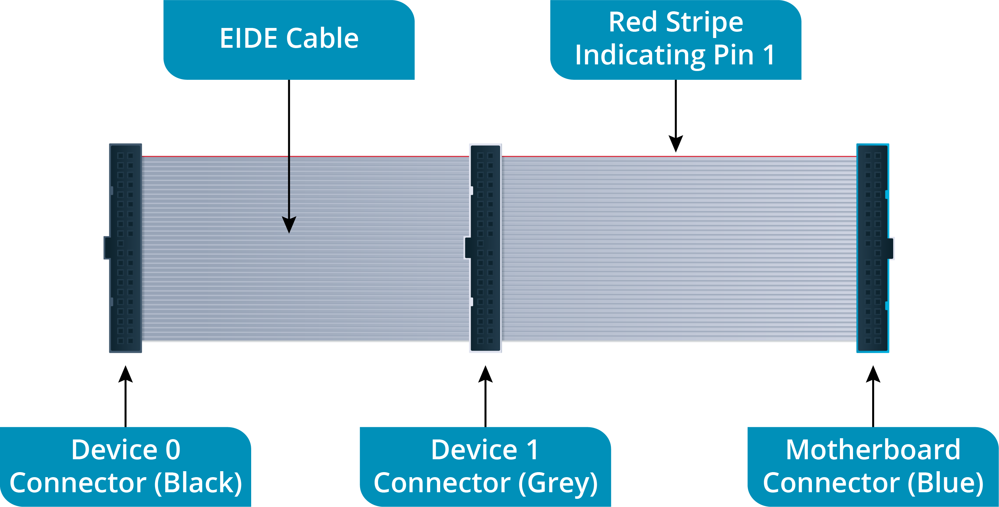

EIDE cable with device 0 (black), device 1 (grey), and motherboard
(blue) connectors. The red strip indicates pin 1 on the cable. (Image
©123RF.com)

</figure>

<figure>

Unfortunately, the terms master and slave were used to distinguish
device 0 and device 1. CompTIA and the computing industry generally are
working to eliminate this type of non-inclusive terminology, but you
will often still see it used in historical support documentation.

</figure>

Serial Cables

The **serial** port is a legacy connection interface where data is
transmitted over one wire one bit at a time. Start, stop, and parity
bits are used to format and verify data transmission. This interface is
also referred to as Recommended Standard #232 (RS-232). While modern
interfaces like USB are also serial, an RS-232 interface uses much less
sophisticated signaling methods. Consequently, an RS-232 serial port
supports data rates up to about 115 Kbps only.

<figure>
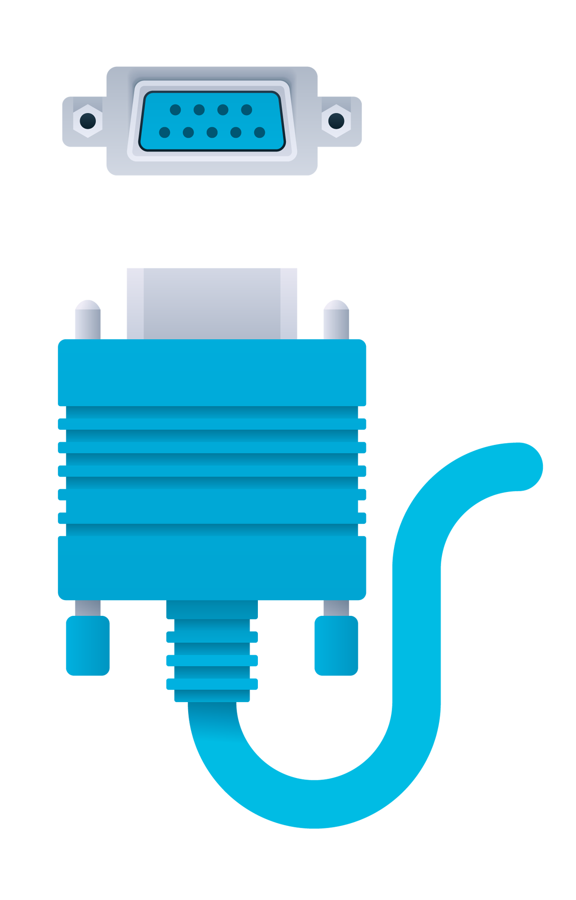

9-pin serial connector and port. (Image ©123RF.com)

</figure>

Serial ports are generally associated with connecting external modems,
used to establish dial-up Internet connections, though even this
function has largely been superseded by USB. You may also come across
serial ports on network equipment, where a serial connection can be used
to manage the device.

RS-232 specifies a 25-pin hardware interface, but in practice, PC
manufacturers used the cheaper 9-pin D-subminiature
([[**DB-9**]{.glossary-term
data-type=""}]{#cd28c273-1859-4839-9720-0b76fc4d7eef .gt-note
.definition
note="
 Legacy connector form factor used for serial (9-pin) and VGA (15-pin) interfaces.
"
ref-id="4b0e31f9-5623-445f-b11f-59ba767950c4"
external-id="83e3aeb9-46a9-4b2a-b287-26265ad9243d"
gtnote="1696350989774--0.8321182756735652"}) female port shown above.

In Windows, the serial port is referred to as a Communications (COM)
port.

<figure>

You might also come across PS/2 serial ports. PS/2 i used to attach
mice and keyboards. PS/2 ports use a 6-pin mini-DIN format. The green
color-coded port is used to attach a mouse, and the purple one is for a
keyboard.

</figure>

Adapter Cables

Given the numerous cable types and connector types, it will often be the
case that a basic peripheral cable will not provide a connection between
a port available on the PC and the port used on the peripheral device.
An adapter cable can often be used to overcome this issue. An
[[**adapter cable**]{.glossary-term
data-type=""}]{#8620ea16-24cd-47cd-bf87-700040ccb1ac .gt-note
.definition
note="
 Peripheral cable converting between connector form factors or between signaling types, such as DisplayPort to HDMI.
"
ref-id="016a79e6-e913-4123-83b0-44eea8ca1b71"
external-id="d58dc9ee-4952-445b-97b9-96bf27b9b68c"
gtnote="1696351016867--0.5947366852718983"} has connectors for two
different cable types at each end. An active adapter uses circuitry to
convert the signal, while a passive adapter simply converts between two
connector form factors.

The following types of adapter cable are typical:

-   Video adapters convert between signaling types, such as HDMI to VGA,
    HDMI to DisplayPort, or HDMI to DVI.
-   USB adapters to convert connector types, such as USB-C to USB-A.
    There are also USB hubs that provide additional ports.
-   USB adapters to various kinds of output, including Lightning and
    HDMI.

\

Review Activity: Legacy Cable Types

<figure>

Answer the following questions:

</figure>

data-id="4d9634c7-fc08-439e-9f8c-8040d2c8cf47"}

1.  **You are labeling systems for inventory. What two types of display
    cabling can be connected to this laptop?**

{.gt-el-image
external-id="ef063635-afbd-4e2c-9e24-eda5af6b6844"}

2.  **Which ports are present on the graphics card shown below?**

{.gt-el-image
external-id="5b4490f7-35c0-4555-8533-1a5c7202e77e"}

3.  Which interfaces does the adapter cable shown below support?

{.gt-el-image
external-id="6e42fdbe-2a08-4a12-bdf3-9b193a7f037f"}

Lesson 1

Summary

You should be able to identify and install types of interfaces and their
physical connectors on the motherboard and on peripheral devices.

Guidelines for Installing and Configuring Motherboards and Connectors

Follow these guidelines to support the installation and configuration of
motherboards, peripheral devices, and connectors:

-   Make support documentation available so that technicians can easily
    identify the features of system cases and motherboards---especially
    ATX/ITX form factor, CPU socket type, and header configuration---and
    perform maintenance and upgrades efficiently.
-   Identify requirements for peripheral cables and connector types so
    that missing or faulty cables can be replaced quickly. Consider
    stocking adapter cables so that use can be made of devices even if
    the connector type is not directly supported by the motherboard.
-   Identify opportunities to upgrade devices that use legacy
    interfaces---VGA, DVI, PCI, EIDE/PATA, SCSI, and RS-232
    serial---with faster and more reliable modern
    versions---USB/Thunderbolt, HDMI, DisplayPort, PCIe, SATA, and M.2.
-   Identify systems that have additional requirements to the
    controllers and ports provided on the motherboard and research the
    best model of video, capture, sound, or network card to meet the
    requirement.

